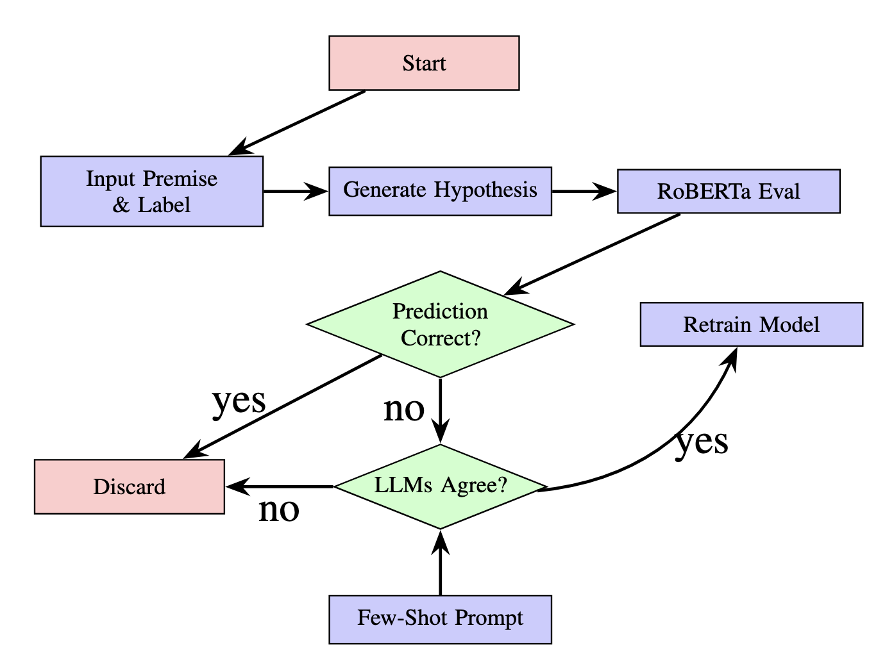

# Enhancing NLI Models

## Project Overview
Enhancing NLI Models is a project designed to improve Natural Language Inference (NLI) systems using the SNLI dataset and pre-trained RoBERTa models. It automates hypothesis generation, identifies incorrect predictions, filters data, and visualizes datasets with statistical insights.



This project is part of the paper titled "Enhancing NLI Models With an Adversarial LLM Approach". Below is the abstract of the paper:
## Abstract

In this paper, we demonstrate that the performance of natural language inference (NLI) models can be enhanced using a novel adversarial approach, in which large language models (LLMs) are used to systematically address NLI models' weaknesses. We first employ the LLMs to adversarially generate challenging NLI examples, looking for instances that are misclassified by the NLI model, effectively creating a dataset. These examples are validated by an ensemble of LLMs to ensure their correctness and are subsequently used to retrain the NLI model, iteratively refining its performance. In our evaluation, the proposed approach demonstrated substantial accuracy improvements on multiple datasets, including 1.43% on the SNLI dataset, 2.75% on the ANLI dataset, and 4.29% on the MultiNLI dataset. Our evaluation highlights the utility of LLMs in adversarial model improvement, providing a pathway toward robust and human-independent enhancements for NLI systems. Additionally, our LLM-based approach can also be used to automate the creation of NLI datasets.

Models (LLMs) to adversarially generate challenging NLI examples that aim to gather instances that are misclassified by the NLI model. These examples are validated by an ensemble of LLMs to ensure their correctness before being used to retrain the NLI model. This iterative process focuses on strengthening the model's ability to handle difficult cases, ultimately improving its performance.

To evaluate our approach, we trained a leading NLI model using our approach and another data augmentation method, on the same amount of data, using 10 different sets of hyper-parameters. We then evaluated this model on three popular NLI test-sets and observed consistent improvements.

The contributions of our work are as follows: (1) our proposed approach systematically addresses NLI model weaknesses, improving their robustness and accuracy, as demonstrated by performance improvements on the SNLI (Oana-Maria, 2018), ANLI, and MultiNLI (Williams et al., 2018a) datasets; (2) we introduce a fully automated dataset creation process that eliminates the traditional reliance on human annotators; and (3) our approach demonstrates scalability, enabling iterative model improvements and dataset refinement.


## Key Features
- **Hypothesis Generation**: Automatically generates hypotheses for premises and target labels.
- **Error Analysis**: Identifies and analyzes incorrect predictions.
- **Visualization**: Creates word clouds and analyzes common words.
- **Dataset Similarity**: Measures similarity between datasets using TF-IDF and cosine similarity.
## File Structure
- `enhancing_nli_models.py`: Main script to run the entire pipeline.
- `creating_hypothesis.py`: Contains functions to generate hypotheses.
- `filtering.py`: Includes logic for error filtering and similarity computation.
- `visualization.py`: Handles word clouds and text analysis visualizations.
- `phrasing.py`: Extracts key phrases and n-grams from text data.
## Installation
1. Clone the repository:
   ```bash
   git clone https://github.com/anon-user159/Enhancing-NLI-Models.git
   cd Enhancing-NLI-Models
   ```
2. Install dependencies:
      ```bash
      pip install -r requirements.txt
      ```

## Usage
Run the main script to execute the pipeline:
```bash
python enhancing_nli_models.py
```

## Dependencies
- `transformers`
- `datasets`
- `pandas`
- `matplotlib`
- `wordcloud`
- `scikit-learn`

## Example Output
- **Visualizations**: Word clouds for hypothesis text.
- **Processed CSV**: Incorrect predictions saved to `incorrect.csv`.


## Acknowledgements
- **SNLI Dataset**: Stanford Natural Language Inference dataset.
- **RoBERTa Model**: Pre-trained NLI model by Hugging Face.

- ## License
This project is licensed under the MIT License.


